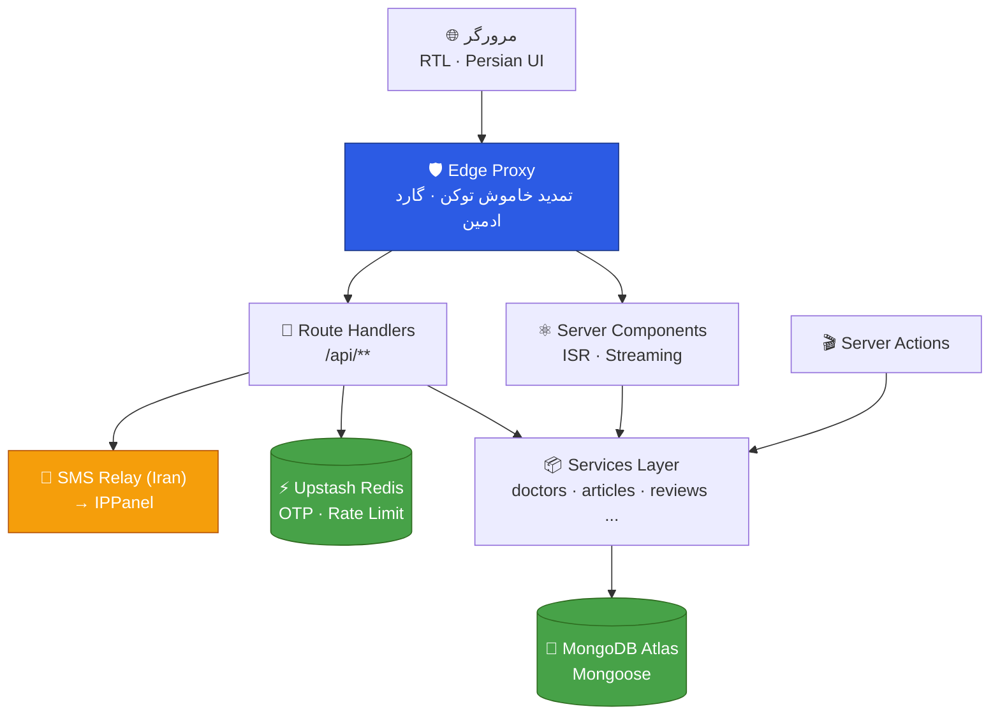
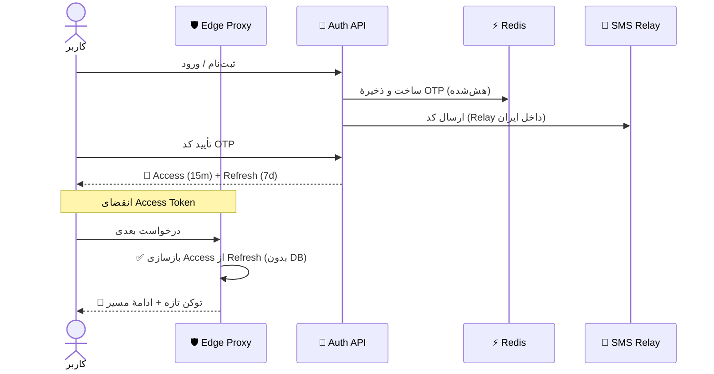
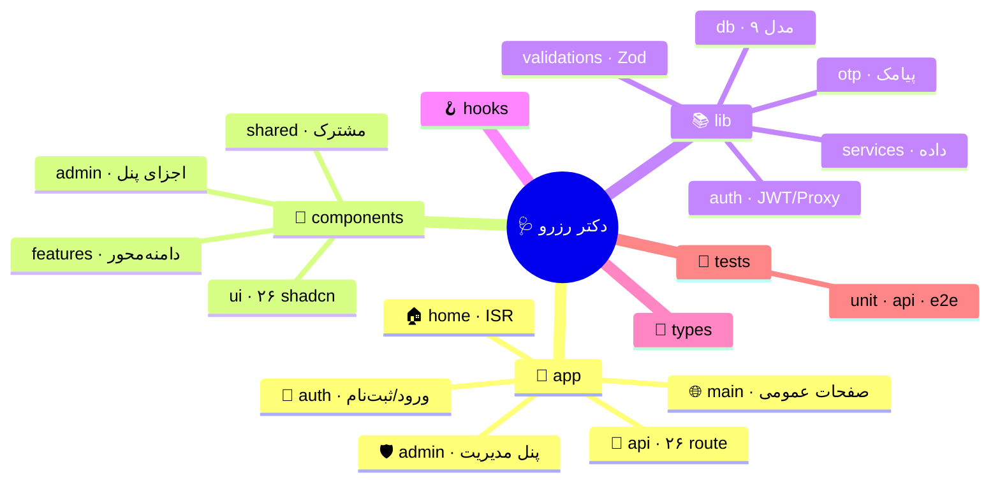
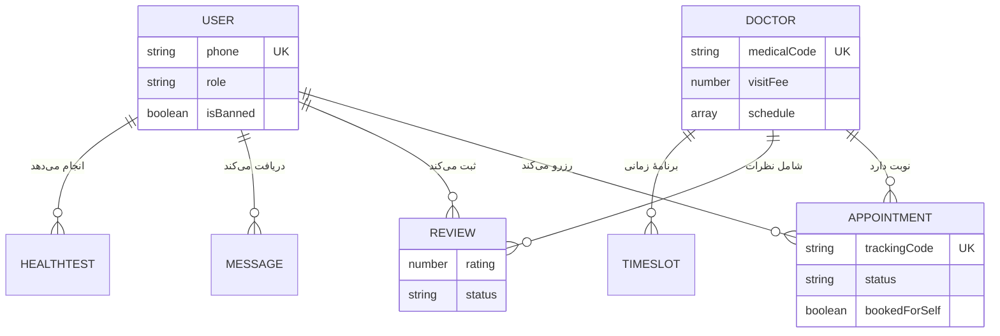

<div align="center">

<br/>


# دکتر رزرو

### 🩺 پلتفرم نوبت‌دهی آنلاین پزشک در سراسر ایران

<p align="center">
<em>رزرو سریع و مطمئن نوبت پزشک متخصص — در کمتر از یک دقیقه ⏱️</em>
</p>

<br/>

<p align="center">
  
  
  
  
  
</p>

<p align="center">
  
  
  
  
</p>

<br/>

<table align="center">
<tr>
<td align="center"><b>📦 ~23.4K</b><br/><sub>خط کد</sub></td>
<td align="center"><b>📄 336</b><br/><sub>فایل منبع</sub></td>
<td align="center"><b>🔌 26</b><br/><sub>API Route</sub></td>
<td align="center"><b>📃 32</b><br/><sub>صفحه</sub></td>
<td align="center"><b>🧩 26</b><br/><sub>UI Component</sub></td>
<td align="center"><b>🗄️ 9</b><br/><sub>مدل داده</sub></td>
<td align="center"><b>🧪 17</b><br/><sub>فایل تست</sub></td>
</tr>
</table>

<br/>

</div>

---

## 📖 فهرست مطالب

<table>
<tr>
<td valign="top">

- [🎯 دربارهٔ پروژه](#-دربارهٔ-پروژه)
- [✨ ویژگی‌ها در یک نگاه](#-ویژگیها-در-یک-نگاه)
- [🧰 پشتهٔ فناوری](#-پشتهٔ-فناوری-tech-stack)
- [🏛️ معماری سامانه](#️-معماری-سامانه)
- [🗂️ نقشهٔ پروژه](#️-نقشهٔ-پروژه-project-map)

</td>
<td valign="top">

- [📂 ساختار پوشه‌ها](#-ساختار-پوشهها-folder-structure)
- [🗄️ مدل‌های داده](#️-مدلهای-داده)
- [🔐 امنیت](#-امنیت-security)
- [🚀 کارایی و SEO](#-کارایی-و-seo)
- [🏁 راه‌اندازی](#-راهاندازی-محلی-getting-started)

</td>
<td valign="top">

- [🔧 متغیرهای محیطی](#-متغیرهای-محیطی-environment-variables)
- [📜 اسکریپت‌ها](#-اسکریپتها)
- [🧪 تست و کیفیت](#-تست-و-کیفیت)
- [☁️ استقرار](#️-استقرار-deployment)
- [📄 مجوز](#-مجوز)

</td>
</tr>
</table>

---

## 🎯 دربارهٔ پروژه

**دکتر رزرو** یک سامانهٔ کامل و آمادهٔ تولید (production-ready) برای **نوبت‌دهی آنلاین پزشکی** است؛ از جست‌وجوی پزشک متخصص و مشاهدهٔ زمان‌های خالی گرفته تا رزرو نوبت، ثبت نظر، و یک **پنل مدیریت** تمام‌عیار برای ادارهٔ پزشکان، کاربران، مقالات و پیام‌ها.

این پروژه با تمرکز بر **معماری تمیز، کارایی بالا، امنیت، و تجربهٔ کاربری فارسی (RTL)** ساخته شده و بر پایهٔ **Next.js 16 / App Router** و **React 19** بنا شده است.

> [!NOTE]
> بیش از **۲۳٬۰۰۰ خط** کد TypeScript در **۳۳۶ فایل**، با حالت سخت‌گیرانهٔ کامل TypeScript و الزام **صفر خطای `tsc --noEmit`** پیش از هر تحویل.

<table>
<tr>
<td align="center" width="33%">🔍<br/><b>جست‌وجوی هوشمند</b><br/><sub>فیلتر بر اساس تخصص، شهر، بیمه، جنسیت و نوع ویزیت</sub></td>
<td align="center" width="33%">📅<br/><b>رزرو اتمیک</b><br/><sub>قفل نوبت در یک round-trip و بستن شکاف TOCTOU</sub></td>
<td align="center" width="33%">📱<br/><b>احراز هویت با OTP</b><br/><sub>پیامک کد یک‌بارمصرف با معماری Relay مخصوص ایران</sub></td>
</tr>
<tr>
<td align="center">⭐<br/><b>نظرات با مدیریت</b><br/><sub>تأیید/رد نظرات توسط ادمین پیش از انتشار</sub></td>
<td align="center">📝<br/><b>مجلهٔ سلامت</b><br/><sub>ویرایشگر غنی Tiptap برای مقالات</sub></td>
<td align="center">🛡️<br/><b>پنل ادمین کامل</b><br/><sub>داشبورد، CRUD، مدیریت کاربران و پیام‌ها</sub></td>
</tr>
</table>

---

## ✨ ویژگی‌ها در یک نگاه

<details open>
<summary><b>👤 سمت کاربر (Patient-Facing)</b></summary>

<br/>

| ویژگی | توضیح |
|:------|:------|
| 🏠 **صفحهٔ اصلی پویا** | پزشکان محبوب و جدید، تخصص‌ها، نظرات و مقالات — با ISR و کش لبه |
| 🔎 **جست‌وجوی پیشرفته** | فیلتر تخصص/شهر/بیمه/جنسیت/نوع ویزیت + مرتب‌سازی، همه در URL با `nuqs` |
| 🩺 **پروفایل پزشک** | سوابق، تعرفه، آدرس، تقویم زمان‌های خالی و نظرات تأییدشده |
| 📅 **رزرو چندمرحله‌ای** | انتخاب نوبت → تأیید → پرداخت → موفقیت، با **کد رهگیری** یکتا |
| 👥 **رزرو برای دیگران** | ثبت نوبت برای فرد دیگر با نام و شمارهٔ بیمار |
| 🚫 **قانون یک نوبت در روز** | جلوگیری از رزرو هم‌زمان دو نوبت فعال در یک روز |
| 🧑‍💼 **پروفایل کاربری** | ویرایش اطلاعات، آپلود آواتار، کد ملی، تاریخ تولد شمسی |
| 📨 **صندوق پیام** | دریافت پاسخ ادمین و نتایج آزمون‌های سلامت |
| ❤️ **آزمون سلامت قلب** | کوییز تعاملی با ارسال نتیجه به ادمین |
| 📚 **مجلهٔ سلامت** | فهرست و صفحهٔ تک‌مقاله با slug فارسی |

</details>

<details>
<summary><b>🛡️ پنل مدیریت (Admin Dashboard)</b></summary>

<br/>

| بخش | قابلیت‌ها |
|:----|:---------|
| 📊 **داشبورد** | شاخص‌های کلیدی و نمای کلی |
| 🧑‍⚕️ **پزشکان** | افزودن/ویرایش/حذف، آپلود تصویر، تنظیم برنامهٔ زمانی |
| 📝 **مقالات** | ساخت و ویرایش با Tiptap، وضعیت پیش‌نویس/منتشرشده |
| 👥 **کاربران** | مشاهده و **مسدودسازی (ban)** کاربران |
| ⭐ **نظرات** | تأیید یا رد نظرات در صف انتظار |
| 📬 **پیام‌های تماس** | مشاهده، تغییر وضعیت و **ارسال پاسخ** به کاربر |
| 🧪 **آزمون‌های سلامت** | بررسی پاسخ‌ها و پاسخ‌دهی به کاربر |

</details>

<details>
<summary><b>⚙️ زیرساخت و مهندسی</b></summary>

<br/>

- 🔐 احراز هویت **JWT دو‌توکنی** (Access 15m + Refresh 7d) روی کوکی httpOnly
- ♻️ **تمدید خاموش توکن (Silent Refresh)** در لایهٔ Edge Proxy بدون نیاز به دیتابیس
- 📱 **OTP پیامکی** با معماری Relay برای دور زدن مسدودسازی جغرافیایی
- 🚦 **محدودسازی نرخ** با Upstash Redis روی OTP و ورود
- 🌐 **SEO کامل** — `robots.ts`، `sitemap.ts` پویا با ISR، OpenGraph و Canonical
- 🧪 **پوشش تست** سه‌لایه با Playwright (unit / api / e2e)

</details>

---

## 🧰 پشتهٔ فناوری (Tech Stack)

<table>
<tr>
<td valign="top" width="50%">

**🎨 Frontend & UI**
- `Next.js 16` — App Router
- `React 19.2` — Server Components
- `TypeScript 5.9` — strict mode
- `Tailwind CSS v4`
- `shadcn/ui` — سبک new-york
- `Radix UI` · `AOS` · `Swiper`
- `Lucide Icons` · `Sonner`

</td>
<td valign="top" width="50%">

**⚙️ Backend & Data**
- `MongoDB Atlas` + `Mongoose 9`
- `Upstash Redis` + `Ratelimit`
- `jose` — JWT
- `bcryptjs` — هش رمز
- `Zod 4` + `React Hook Form`
- `SWR` · `nuqs`
- `IPPanel` — پیامک OTP

</td>
</tr>
<tr>
<td valign="top">

**🇮🇷 ابزارهای فارسی**
- `jalaali-js` — تاریخ شمسی
- `react-multi-date-picker`
- فونت `Vazirmatn`
- regex متمرکز (موبایل/کد ملی)

</td>
<td valign="top">

**🧪 کیفیت و تست**
- `Playwright` — unit · api · e2e
- `ESLint 9` · `Prettier`
- `Tiptap 3` — ویرایشگر متن
- TypeScript strict کامل

</td>
</tr>
</table>

---

## 🏛️ معماری سامانه



### 🔑 جریان احراز هویت



> [!IMPORTANT]
> نقش کاربر (`role`) داخل **Refresh Token** قرار می‌گیرد تا لایهٔ Edge بدون هیچ خواندنی از دیتابیس، توکن تازه صادر کند و سبک و Edge-safe بماند. بررسی قطعی نقش و وضعیت ban در لایهٔ Node (لایوت ادمین و Route Handlerها) دوباره از دیتابیس اعتبارسنجی می‌شود.

---

## 🗂️ نقشهٔ پروژه (Project Map)

نمای کلی سازمان‌دهی کد در یک نگاه:



---

## 📂 ساختار پوشه‌ها (Folder Structure)

> [!TIP]
> پروژه با اصل **تفکیک مسئولیت‌ها (Separation of Concerns)** سازمان‌دهی شده: مسیرها، کامپوننت‌ها، و منطق دامنه (`lib`) کاملاً از هم جدا هستند.

<details open>
<summary><b>🌳 درخت کامل پروژه</b></summary>

```text
doctor-booking/
│
├── 📂 src/
│   │
│   ├── 📱 app/                      ← App Router (مسیرها، لایوت‌ها، API)
│   │   ├── 🏠 (home)/               صفحهٔ اصلی — ISR، بدون کوکی، کاملاً کش‌شده
│   │   ├── 🌐 (main)/               صفحات عمومی
│   │   │   ├── doctors/             فهرست + پروفایل پزشک [id]
│   │   │   ├── booking/             رزرو: confirm · payment · success
│   │   │   ├── articles/            مجله + تک‌مقاله [slug]
│   │   │   ├── appointments/        نوبت‌های کاربر
│   │   │   ├── profile/ · inbox/    پروفایل و صندوق پیام
│   │   │   └── about-us · contact-us · faq · specialties
│   │   ├── 🛡️ admin/                پنل مدیریت (force-dynamic · گارد ادمین)
│   │   │   ├── doctors/ · articles/ users/ · reviews/
│   │   │   ├── contact-messages/ · health-tests/
│   │   │   └── layout.tsx           ⟵ requireAdmin() + قفل اسکرول
│   │   ├── 🔑 auth/                 login · register · banned
│   │   ├── 🔌 api/                  ۲۶ Route Handler
│   │   │   ├── auth/                login·logout·register·verify-otp·resend-otp·me
│   │   │   ├── doctors/[id]/        book · reviews · schedule
│   │   │   ├── admin/               doctors·articles·users·upload·contact-messages
│   │   │   ├── profile/ · reviews/ contact/ · newsletter/
│   │   │   └── health/db/           ⟵ تشخیص دقیق خطای اتصال DB
│   │   ├── ⚛️ layout.tsx            ریشهٔ RTL + فونت Vazirmatn + Providerها
│   │   ├── 🤖 robots.ts             مسیر متادیتای SEO
│   │   ├── 🗺️ sitemap.ts            sitemap پویا (پزشکان + مقالات) با ISR
│   │   └── 🎨 globals.css           پالت رنگ + تم RTL ویرایشگر Tiptap
│   │
│   ├── 🧩 components/
│   │   ├── ui/                      ۲۶ کامپوننت shadcn/ui (سبک new-york)
│   │   ├── features/                ⭐ کامپوننت‌های دامنه‌محور
│   │   │   ├── home/        (14)    hero · search · quiz · testimonials
│   │   │   ├── doctors/     (11)    کارت، فیلتر، فهرست
│   │   │   ├── booking/     (10)    مراحل رزرو
│   │   │   ├── profile/     (10)    فرم‌ها و کارت‌ها
│   │   │   ├── auth/        (9)     ورود/ثبت‌نام/OTP
│   │   │   └── contact-us · doctor-profile · review · articles ...
│   │   ├── admin/                   🛡️ اجزای پنل (dashboard·doctors·users·messages)
│   │   ├── shared/                  🔁 doctor-card · reviews · pagination · inbox
│   │   ├── layout/                  header · footer · newsletter
│   │   └── providers/               AOS · Zod-fa · DeferredToaster
│   │
│   ├── 📚 lib/                      ← منطق دامنه و زیرساخت
│   │   ├── 🔐 auth/                 jwt · session · proxy · login-rate-limit
│   │   ├── 🍃 db/
│   │   │   ├── connection.ts        کش اتصال + تشخیص دقیق خطا
│   │   │   └── models/      (9)     User·Doctor·Appointment·Article·City ...
│   │   ├── 📱 otp/                  service · limiter · redis · config
│   │   ├── 📨 sms/                  provider با مسیریابی Relay
│   │   ├── 📦 services/     (12)    لایهٔ سرویس داده (doctors·articles·reviews)
│   │   ├── 🎬 actions/              Server Actions
│   │   ├── ✅ validations/  (9)     اسکیماهای Zod + regex متمرکز
│   │   ├── 📌 constants/            specialties · filters · site URL resolver
│   │   └── 🛠️ utils/                persian-format · seo · cn · jalaali ...
│   │
│   ├── 🪝 hooks/            (8)     useDoctors · useJalaali · useFilterParams ...
│   ├── 📐 types/                    تایپ‌های مشترک (doctor·filters·otp·review)
│   └── 🔤 fonts/                    Vazirmatn (Regular · Medium · Bold · woff2)
│
├── 🧪 tests/
│   ├── unit/                        منطق خالص — regex·crypto·jalaali·validations
│   ├── api/                         Route Handlerها — doctors·contact·newsletter
│   └── e2e/                         جریان کاربر + بررسی RTL و A11y
│
├── 🌐 public/                       تصاویر برند · og-cover · آپلودها
├── ⚙️ next.config.ts                هدرهای امنیتی · بهینه‌سازی · تصاویر
├── 🎭 playwright.config.ts          سه پروژهٔ تست
├── 🎨 components.json               پیکربندی shadcn/ui
└── 📦 package.json
```

</details>

### 🧭 راهنمای پوشه‌های کلیدی

| پوشه | مسئولیت | چرا اینجا؟ |
|:-----|:--------|:-----------|
| `app/(home)` | صفحهٔ اصلی | جدا از `(main)` چون **هیچ کوکی نمی‌خواند** → کاملاً کش‌شده با ISR |
| `app/(main)` | صفحات عمومی | چیدمان مشترک header/footer |
| `app/admin` | پنل مدیریت | `force-dynamic` + گارد `requireAdmin()` در لایوت |
| `lib/services` | لایهٔ داده | تنها مرز تماس با دیتابیس — قابل استفادهٔ مجدد در RSC و API |
| `lib/auth` | احراز هویت | منطق JWT و Proxy، Edge-safe و بدون وابستگی به Mongoose |
| `lib/validations` | اعتبارسنجی | اسکیماهای Zod + regex متمرکز در یک مکان (single source of truth) |
| `components/features` | UI دامنه‌محور | هر دامنه (booking، doctors، ...) کامپوننت‌های خودش را دارد |
| `components/ui` | پایهٔ طراحی | کامپوننت‌های shadcn/ui قابل استفادهٔ مجدد در کل پروژه |

---

## 🗄️ مدل‌های داده



| مدل | نقش | نکات کلیدی |
|:----|:-----|:----------|
| **User** | کاربر/ادمین | `password` با `select:false` · ایمیل sparse-unique · `isBanned` |
| **Doctor** | پزشک | زیراسکیمای `schedule` و `reviews` · ویرچوال `firstAvailable` و `reviewStats` |
| **Appointment** | نوبت | `trackingCode` یکتا · `bookedForSelf` · active/expired/cancelled |
| **Article** | مقاله | `slug` یکتا · draft/published · tags |
| **City** | شهر | کالکشن مرجع پویا برای فیلتر شهرها |
| **ContactMessage** | پیام تماس | new/seen/replied · `adminReply` |
| **Message** | پیام صندوق | پیوند اختیاری به نتیجهٔ آزمون سلامت |
| **HealthTestResult** | نتیجهٔ آزمون | snapshot اطلاعات کاربر در زمان آزمون |
| **NewsletterSubscriber** | مشترک خبرنامه | active/unsubscribed |

> [!IMPORTANT]
> **رزرو اتمیک نوبت:** عملیات رزرو با یک `findOneAndUpdate` تک‌مرحله‌ای انجام می‌شود؛ زمان نوبت بخشی از فیلتر کوئری است، بنابراین MongoDB در شرایط رقابتی (race) فقط برای **یک** درخواست تطبیق می‌دهد و شکاف TOCTOU بسته می‌شود.

---

## 🔐 امنیت (Security)

| لایه | محافظت |
|:-----|:-------|
| 🍪 **توکن‌ها** | کوکی httpOnly — مصون در برابر دسترسی جاوااسکریپت کلاینت |
| 🔑 **رمز عبور** | هش با bcrypt + حذف فیلد از خروجی کوئری (`select:false`) |
| 🛡️ **هدرها** | `nosniff` · `X-Frame-Options` · `Referrer-Policy` · حذف `X-Powered-By` |
| 🚦 **Brute-Force** | محدودیت ۸ تلاش ورود در ۵ دقیقه به‌ازای هر IP (fail-open) |
| 🔢 **OTP** | کد ۵ رقمی · انقضای ۵ دقیقه · حداکثر ۳ تلاش · حداکثر ۳ ارسال در ۱۰ دقیقه |
| 👮 **RBAC** | گارد خوش‌بینانه در Edge + اعتبارسنجی قطعی نقش از DB در Node |
| ✅ **اعتبارسنجی** | Zod در تمام مرزها (API/اکشن/فرم) با regex متمرکز |

---

## 🚀 کارایی و SEO

<table>
<tr>
<td width="50%" valign="top">

### ⚡ کارایی
- رندر Server Components + **ISR** روی صفحات پرترافیک
- **Tree-shaking** ایمپورت‌های barrel با `optimizePackageImports`
- تصاویر **AVIF/WebP** با کش لبهٔ یک‌روزه
- **Preload فونت** Vazirmatn با `display: swap`
- کش اتصال Mongoose برای Serverless گرم
- هدرهای کش `immutable` برای دارایی‌های برند

</td>
<td width="50%" valign="top">

### 🔍 SEO
- `metadataBase` با **Resolver هوشمند** که هرگز localhost را به تولید نشت نمی‌دهد
- `sitemap.ts` **پویا** (پزشکان + مقالات) با ISR ساعتی
- `robots.ts` با مسدودسازی مسیرهای خصوصی
- متادیتای **OpenGraph / Twitter Card** و Canonical
- slugهای فارسی به‌درستی percent-encode شده

</td>
</tr>
</table>

---

## 🏁 راه‌اندازی محلی (Getting Started)

> [!NOTE]
> **پیش‌نیازها:** Node.js نسخهٔ ۲۰+ · یک پایگاه دادهٔ MongoDB · یک نمونهٔ Upstash Redis

```bash
# ۱) کلون و نصب وابستگی‌ها
git clone <repo-url> doctor-booking
cd doctor-booking
npm install

# ۲) ساخت فایل محیطی از روی نمونه
cp .env.example .env.local
#  ↳ سپس مقادیر واقعی را در .env.local قرار دهید

# ۳) اجرای سرور توسعه
npm run dev
```

سپس مرورگر را روی [`http://localhost:3000`](http://localhost:3000) باز کنید. 🚀

> [!WARNING]
> متغیرهای محیطی hot-reload نمی‌شوند؛ پس از هر تغییر در `.env.local`، سرور را **restart** کنید.

---

## 🔧 متغیرهای محیطی (Environment Variables)

```dotenv
# 🍃 MongoDB Atlas — رشتهٔ اتصال SRV (رمز عبور را URL-encode کنید)
MONGODB_URI="mongodb+srv://..."

# 🔐 رازهای JWT (هرکدام رشته‌ای تصادفی و طولانی)
ACCESS_TOKEN_SECRET="..."
REFRESH_TOKEN_SECRET="..."

# 📱 پیامک OTP (IPPanel)
SMS_API_KEY="..."
SMS_FROM_NUMBER="..."
SMS_PATTERN_CODE="..."

# 🇮🇷 (اختیاری · تولید) Relay برای عبور از مسدودسازی جغرافیایی IPPanel
SMS_RELAY_URL="https://your-iran-relay.example/send"
SMS_RELAY_SECRET="..."

# ⚡ Upstash Redis (OTP + rate limiting)
UPSTASH_REDIS_REST_URL="..."
UPSTASH_REDIS_REST_TOKEN="..."

# 🌐 دامنهٔ کانونیکال (برای metadataBase / OG / sitemap)
NEXT_PUBLIC_BASE_URL="http://localhost:3000"   # تولید: https://your-domain.ir
```

> [!IMPORTANT]
> **معماری Relay پیامک:** سرویس IPPanel پشت Cloudflare، درخواست از IPهای دیتاسنتر خارج از ایران (مثل Vercel روی AWS) را با خطای `502` رد می‌کند. با تنظیم `SMS_RELAY_URL`، ارسال پیامک از طریق یک Relay با IP داخل ایران انجام می‌شود و کلیدهای IPPanel هرگز روی Vercel قرار نمی‌گیرند. اگر تنظیم نشود، در توسعه مستقیماً IPPanel فراخوانی می‌شود.

---

## 📜 اسکریپت‌ها

| دستور | کاربرد |
|:------|:-------|
| `npm run dev` | اجرای سرور توسعه |
| `npm run build` | ساخت نسخهٔ تولید |
| `npm run start` | اجرای نسخهٔ تولید |
| `npm run lint` | بررسی با ESLint |
| `npm run test` | اجرای تمام تست‌های Playwright |
| `npm run test:unit` | فقط تست‌های واحد (بدون مرورگر) |
| `npm run test:api` | فقط تست‌های API |
| `npm run test:e2e` | فقط تست‌های End-to-End |
| `npm run test:ui` | اجرای تست‌ها در حالت UI تعاملی |
| `npm run test:report` | نمایش گزارش آخرین اجرای تست |

---

## 🧪 تست و کیفیت

استراتژی تست **سه‌لایه** با Playwright:

```text
🧩 unit  →  منطق خالص: regex · crypto OTP · تاریخ شمسی · فرمت فارسی · Zod
🔌 api   →  Route Handlerها: doctors · contact · newsletter
🎭 e2e   →  جریان کاربر: home · doctors · navigation · auth-guards · RTL/A11y
```

**استانداردهای کیفیت کد:**

- ✅ TypeScript در سخت‌گیرانه‌ترین حالت (`strict` + `noUncheckedIndexedAccess` + `exactOptionalPropertyTypes`) با الزام **صفر خطای `tsc --noEmit`**
- 🎨 یکدستی با Prettier و ESLint 9
- 🧠 کامنت‌های انگلیسی **مختصر، خوانا و باکیفیت** در سراسر کد

---

## ☁️ استقرار (Deployment)

این پروژه برای **Vercel** بهینه شده است. چک‌لیست تولید:

- [x] تعریف تمام متغیرهای محیطی در **Settings → Environment Variables** (Production)
- [x] تنظیم `NEXT_PUBLIC_BASE_URL` روی **دامنهٔ واقعی** (نه localhost) برای canonical/OG/sitemap درست
- [x] تنظیم **Network Access** در MongoDB Atlas روی `0.0.0.0/0` تا IPهای پویای Vercel مسدود نشوند
- [x] تنظیم `SMS_RELAY_URL` و `SMS_RELAY_SECRET` برای عبور از مسدودسازی جغرافیایی پیامک

---

## 🤝 مشارکت

این یک پروژهٔ خصوصی است. برای پیشنهاد بهبود یا گزارش باگ، لطفاً یک Issue باز کنید.

## 📄 مجوز

این پروژه **خصوصی** است و تمام حقوق آن محفوظ است.

---

<div align="center">

<br/>

**ساخته‌شده با ❤️ و دقت مهندسی**

<sub>Next.js 16 · React 19 · TypeScript · Tailwind v4 · MongoDB · Upstash Redis</sub>

<br/><br/>


</div>
